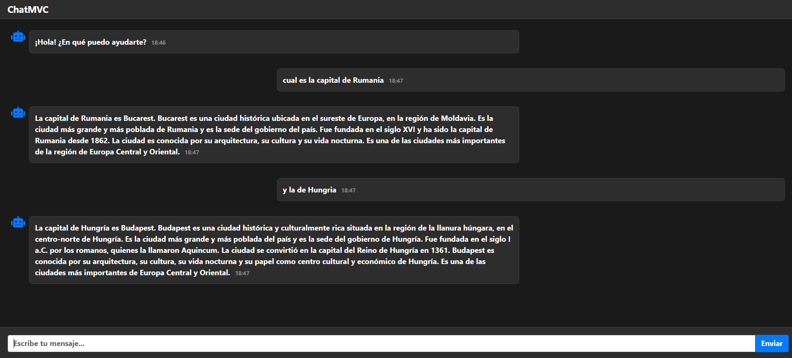

## ChatMVC

**ChatMVC** is an interactive web interface that allows users to chat with the Mistral 7B model using an OpenRouter API. Index loads the initial view using the ChatViewModel. SendMessage (POST) receives the user's message via AJAX, adds the message to the history, calls the MistralService service to retrieve the response from the IA model, and returns the response as JSON.



CharMVC/  
├── Controllers/  
│   └── HomeController.cs  
├── Models/  
│   ├── ChatMessage.cs  
│   ├── ChatViewModel.cs  
│   ├── Choice.cs  
│   ├── ErrorViewModel.cs  
│   ├── Message.cs  
│   └── OpenRouterResponse.cs   
├── Services/  
│   ├── IMistralService.cs   
│   └── MistralService.cs   
├── Views/  
│   └── Home      
│        └── Index.cshtml  
├── appsettings.json     
└── Program.cs    

## appsetting.json
```cs 
{
  "OpenRouter": {
    "ApiKey": "*",
    "Model": "mistralai/mistral-7b-instruct"
  },
``` 

[DeepWiki moraisLuismNet/ChatMVC](https://deepwiki.com/moraisLuismNet/ChatMVC)